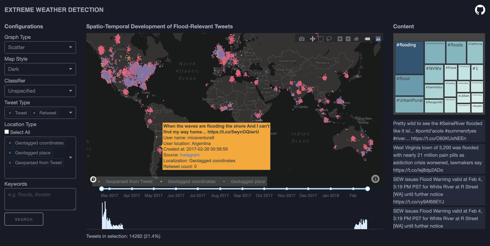

### [EXTREME WEATHER DETECTION](https://extremeweatherdetection.herokuapp.com/)

This repo consists of the code for the M.Sc. thesis project [Identification and Exploration of Extreme Weather Events From Twitter Data](https://github.com/s153748/extreme-weather-detection/blob/main/thesis.pdf) prepared at the [Technical University of Denmark (DTU)](https://www.dtu.dk/) during the Spring 2021. The project was completed as a part of the research project [AI for Climate Adaptation](https://liu.se/en/research/ai4climateadaptation) at [Linköping University (LiU)](https://liu.se/). 

The objective was to implement AI-based methods to identify and visually explore extreme weather events, particularly floods, from social geodata. To this end, the main tasks were to implement text data mining methods for identification of relevant flood events from Twitter data and to create an accompanying [visual interface](https://extremeweatherdetection.herokuapp.com/) for exploring the events. The code for the application is seen in the file [app.py](https://github.com/s153748/extreme-weather-detection/blob/main/app.py), whereas the remaining code is gathered in an explainer [notebook](https://nbviewer.jupyter.org/github/s153748/extreme-weather-detection/blob/main/notebook.ipynb). 

### M.Sc. Thesis Abstract

Extreme weather events are becoming more frequent and intense due climate change. When disaster events are emerging, up-to-date information from eye-witnesses is crucial for early detection and resilience. Recently, Twitter has become an important source of **volunteered geographic information** of key value for global monitoring systems and for increasing situational awareness. Hence, in this project, a pipeline of several steps was developed for identification of flood events from relevant textual data retrieved from Twitter. Initially, **artificial intelligence** based approaches were used for the task of classifying Tweets as relevant or not to a flood event. Specifically, four text classifiers were build using the classic algorithms, **logistic regression** and **random forest**, **deep learning** in the form of a **convolutional neural network** and lastly the **transfer learning** technique called **universal language model fine-tuning**. The highest accuracy was achieved using transfer learning, though promising accuracies above 90% were obtained with all approaches. Inspection of the classification of Tweets from a use case however revealed that further training and testing is needed to increase the reliability of the classifiers. Secondly, to detect areas with risk of flooding, a **location extraction** algorithm was constructed with use of geotags and **geoparsing** to relate the Tweets to a geographic location. Lastly, an **interactive visual interface** was developed using multiple coordinated views to enable exploration across the spatial, temporal and textual aspects of the Tweets. A demonstration of the interface on a use case enabled comparison to historical records showing the relevance of the pipeline. In general, the pipeline establishes a baseline of how to use Twitter data for flood detection as a supplement to other traditional monitoring systems. This can potentially be expanded to include more information sources and identify different kinds of extreme weather events.
